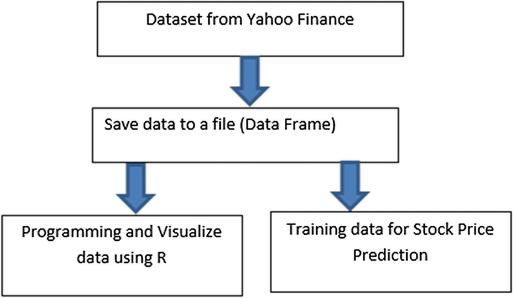
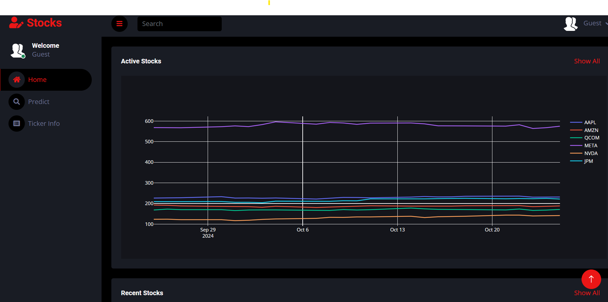
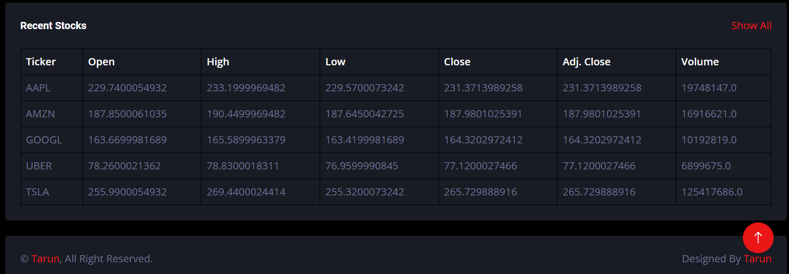

## Stock Analysis Web App
The integration of a stock analysis web application offers users a seamless platform for tracking and predicting stock trends. By utilizing the yFinance API and implementing linear regression models, this project aims to simplify financial analysis and assist users in making informed investment decisions.

## About
The Stock Analysis Web App leverages financial data from the yFinance API, allowing users to access real-time and historical stock market information. Traditional methods of financial analysis often require complex tools and financial expertise. This web app bridges the gap by providing an easy-to-use interface, enabling users to conduct stock analysis and view predictions directly on the platform.
The core of the system integrates linear regression models to forecast stock prices based on historical data, helping investors identify trends and make well-informed decisions.

## Features
Implements yFinance API for seamless access to stock market data.
Uses linear regression algorithms to forecast stock prices based on historical trends.
High scalability for processing large financial datasets.
Web-based framework for easy deployment and usage.
Real-time stock data visualization through graphs and charts.
JSON data format support for external API integration.

## Requirements
Operating System: Requires a 64-bit OS (Windows 10, macOS, or Ubuntu).
Development Environment: Python 3.7 or later.
Data Science Libraries: pandas, numpy, scikit-learn for data processing and regression modeling.
Web Framework: Node JS.
API Access: yFinance library for fetching stock data.
Graphing Library: Matplotlib and Plotly for data visualization.
IDE: Use of VSCode for code development and debugging.
Version Control: Git for collaborative development.
Browser: Google Chrome or Firefox for accessing the web app.

## System Architecture

## Output

<!--Embed the Output picture at respective places as shown below as shown below-->
#### Output1 - Stocks Plot

#### Output2 - Recent Stocks

## Results and Impact
The Stock Analysis Web App empowers individual investors with accessible financial tools, simplifying the analysis process and providing actionable insights. The combination of real-time data access through the yFinance API and predictive modeling with linear regression makes it a powerful resource for both novice and experienced traders.
The project demonstrates how data science techniques can enhance decision-making in financial markets. Additionally, it lays the groundwork for future enhancements, such as incorporating more advanced machine learning models to improve forecast accuracy.
This project serves as a foundation for future developments in assistive technologies and contributes to creating a more inclusive and accessible digital environment.

## Articles published / References
1. X. Zhang, Z. Zhao, and S. Xu, “Linear Regression and Its Applications in Stock Market Prediction,” Applied Economics Letters, vol. 30, no. 6, pp. 402–408, 2022. DOI:
2. M. Patel and J. R. Taylor, “Forecasting Stock Prices Using Machine Learning Models and yFinance Data,” Journal of Computational Finance, vol. 24, no. 2, pp. 112–124, 2023.

